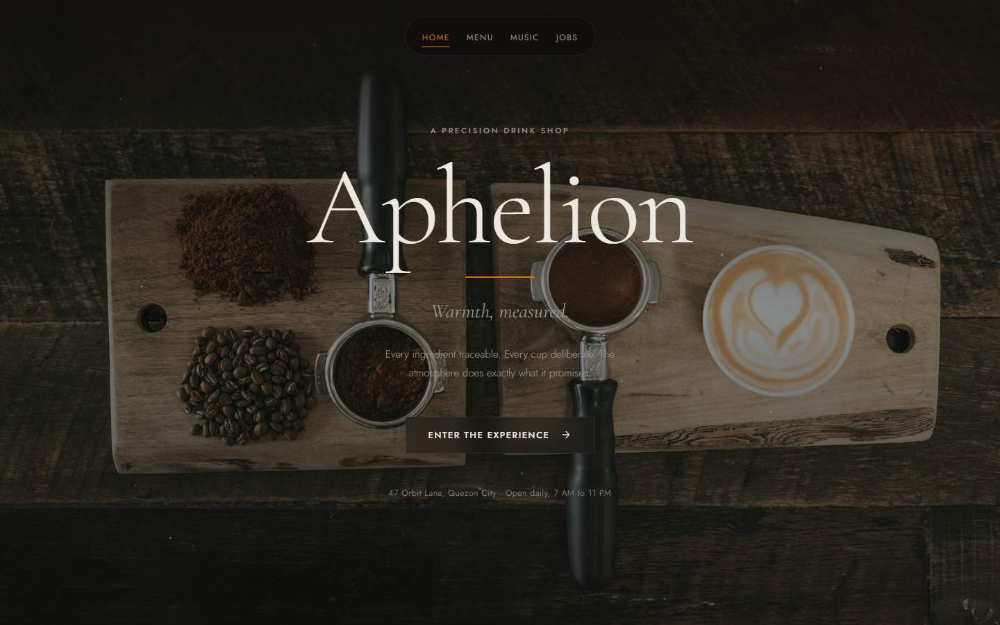

# Aphelion Brews

<p align="center">
  <strong>Single-page fictional drink shop with a cinematic dark UI.</strong><br>
  CSS-first navigation. Vanilla HTML, CSS, and JavaScript.
</p>

<p align="center">
  <a href="https://cikeyz.github.io/aphelion-brews/">Live Demo</a>
  &nbsp;·&nbsp;
  <a href="#quick-start">Quick Start</a>
  &nbsp;·&nbsp;
  <a href="#project-structure">Structure</a>
  &nbsp;·&nbsp;
  <a href="#license">License</a>
</p>

<p align="center">
  
  
  
  
  
</p>

## Contents

- [Overview](#overview)
- [Features](#features)
- [Screenshots](#screenshots)
- [Quick Start](#quick-start)
- [Project Structure](#project-structure)
- [Other Design Eras](#other-design-eras)
- [License](#license)
- [Course Note](#course-note)

## Overview

Aphelion Brews is a marketing-style SPA for a fictional cafe. Section navigation is driven primarily by radio inputs and CSS, with a small JavaScript layer for media and polish. Home, menu, music, and jobs share one HTML document.

## Features

| Feature | Description |
|---------|-------------|
| CSS-first nav | Section switching with radio inputs |
| Cinematic dark UI | Glass panels and editorial type |
| Multi-section SPA | Home, menu, music, and jobs |
| Light JS layer | Media helpers without a framework |

## Screenshots

| Landing |
|---------|
|  |

## Quick Start

```bash
git clone https://github.com/cikeyz/aphelion-brews.git
cd aphelion-brews
python -m http.server 8000
# http://localhost:8000
```

## Project Structure

```text
aphelion-brews/
├── index.html
├── styles.css
├── main.js
├── LICENSE
├── README.md
└── docs/
    └── screenshots/
        └── landing.png
```

## Other Design Eras

Major UI experiments stay on open branches (not merged into `main`):

| Branch | Description |
|--------|-------------|
| `overhaul/quiet-cosmic` | Dark quiet-cosmic sidebar |
| `overhaul/light-editorial` | Light editorial magazine |
| `overhaul/dynamic-spreads` | Full-viewport dynamic spreads |
| `overhaul/cinematic-draft` | Near-final cinematic draft |

## License

MIT. See [LICENSE](LICENSE).

## Course Note

Built for CMPE 364 (Web and Mobile Systems), Polytechnic University of the Philippines, under Engr. Arlene B. Canlas. Published here as a standalone project.
